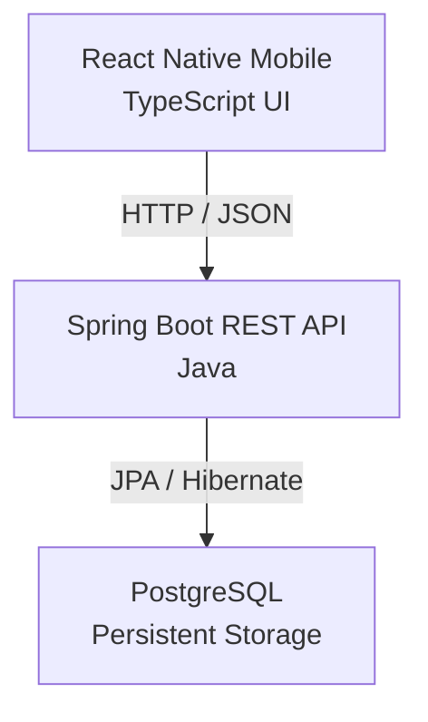

# JobTrack 📱

**A full-stack mobile application for organizing and tracking the job search process.**

Built and maintained by **Abishek Lwagun (`abinit`)**  
Computer Science • Software Engineering • Product Building

JobTrack started from a problem I personally experienced while applying for software engineering roles: once the number of applications grows, it becomes difficult to remember where I applied, which applications need follow-up, and where each opportunity currently stands.

Instead of managing that information across notes, spreadsheets, emails, and browser tabs, I built **JobTrack** as a centralized mobile job-search dashboard.

---

## 📱 App Preview

<p align="center">
  
  &nbsp;&nbsp;&nbsp;&nbsp;
  
</p>

<br>

<p align="center">
  
  &nbsp;&nbsp;&nbsp;&nbsp;
  
</p>

---

## ✨ Features

- Create and track job applications
- Edit existing applications
- Delete applications
- Track applications through `Applied`, `Interview`, `Rejected`, and `Offer` statuses
- View total application statistics
- Filter applications by status
- Store company, position, location, and job URL
- Store job descriptions and personal notes
- Track application dates
- Schedule follow-up dates
- Track interview dates
- Persist application data in PostgreSQL
- Access everything through a React Native mobile interface

---

## 🏗️ Architecture

JobTrack uses a full-stack architecture with a React Native mobile client, Spring Boot REST API, and PostgreSQL database.



The frontend and backend are maintained in the same repository while remaining independently runnable applications.

The React Native client communicates with the Spring Boot backend through HTTP requests using JSON. The backend handles application logic and persistence through Spring Data JPA and Hibernate, with PostgreSQL providing persistent relational storage.

---

## 🛠️ Tech Stack

### Mobile

- React Native
- TypeScript
- React Navigation
- React Native DateTimePicker

### Backend

- Java 17
- Spring Boot
- Spring Web
- Spring Data JPA
- Hibernate
- Maven

### Database

- PostgreSQL

### Testing

- JUnit
- Spring Boot Test
- MockMvc
- Transactional repository tests

---

## 🔌 REST API

JobTrack exposes REST endpoints for the core application lifecycle.

| Method | Endpoint | Description |
|---|---|---|
| `GET` | `/applications` | Retrieve all applications |
| `GET` | `/applications/{id}` | Retrieve an application by ID |
| `POST` | `/applications` | Create a new application |
| `PUT` | `/applications/{id}` | Update an existing application |
| `DELETE` | `/applications/{id}` | Delete an application |

### Example Request

```json
{
  "company": "Example Company",
  "position": "Software Engineer",
  "status": "Applied",
  "applicationDate": "2026-10-05",
  "location": "Minneapolis, MN",
  "jobUrl": "https://example.com/job",
  "jobDescription": "Backend software engineering position",
  "notes": "Applied through company website",
  "followUpDate": null,
  "interviewDate": null
}
```

The backend validates required application fields before persisting a new application.

---

## 🧪 Testing

JobTrack includes automated backend tests covering application startup, persistence behavior, and REST API behavior.

### Repository Tests

Repository tests verify the core database operations:

```text
CREATE  → Save an application and generate an ID
READ    → Retrieve an application by ID
UPDATE  → Modify and persist an existing application
DELETE  → Remove an application
```

Repository tests interact with PostgreSQL while using transactional rollback so test records do not remain in the development database after each test.

### API Tests

MockMvc is used to simulate HTTP requests against the Spring Boot application and verify behavior including:

- Successful `GET` requests
- `404 Not Found` for applications that do not exist
- Successful application creation
- `400 Bad Request` for invalid application data

### Current Test Suite

```text
BackendApplicationTests       1 test
ApplicationRepositoryTests    4 tests
ApplicationControllerTests    4 tests

Total                         9 tests
```

The complete backend test suite currently passes with **0 failures and 0 errors**.

---

## 📁 Project Structure

```text
JobTrack/
│
├── android/                         # Android application
├── ios/                             # iOS application
│
├── src/
│   ├── components/                  # Reusable React Native components
│   ├── config/                      # API configuration
│   ├── navigation/                  # Application navigation
│   ├── screens/                     # Mobile application screens
│   └── types/                       # TypeScript models
│
├── backend/
│   ├── src/main/java/
│   │   └── com/jobtrack/backend/
│   │       ├── Application.java
│   │       ├── ApplicationController.java
│   │       ├── ApplicationRepository.java
│   │       └── BackendApplication.java
│   │
│   ├── src/main/resources/
│   │   └── application.properties
│   │
│   ├── src/test/java/
│   │   └── com/jobtrack/backend/
│   │       ├── BackendApplicationTests.java
│   │       ├── ApplicationRepositoryTests.java
│   │       └── ApplicationControllerTests.java
│   │
│   └── pom.xml
│
├── App.tsx
├── package.json
├── README.md
└── LICENSE
```

---

## 🚀 Running JobTrack Locally

### Prerequisites

Before running JobTrack, install:

- Node.js
- npm
- Java 17
- PostgreSQL
- Android Studio / Android SDK
- Android Emulator or compatible Android device

### 1. Clone the Repository

```bash
git clone https://github.com/AbishekLwagun/JobTrack.git
cd JobTrack
```

### 2. Install Mobile Dependencies

```bash
npm install
```

### 3. Create the PostgreSQL Database

Create a local PostgreSQL database named `jobtrack`:

```sql
CREATE DATABASE jobtrack;
```

### 4. Configure the Database Password

JobTrack does **not** store the PostgreSQL password directly in source control.

The Spring Boot backend expects the following environment variable:

```text
DB_PASSWORD
```

On Windows PowerShell, it can be configured with:

```powershell
[System.Environment]::SetEnvironmentVariable(
    "DB_PASSWORD",
    "your-postgresql-password",
    "User"
)
```

Restart the terminal or IDE after creating the environment variable.

The backend configuration references the variable using:

```properties
spring.datasource.password=${DB_PASSWORD}
```

### 5. Start the Backend

From the project root:

```powershell
cd backend
.\mvnw.cmd spring-boot:run
```

The REST API runs locally at:

```text
http://localhost:8080
```

### 6. Start Metro

Open another terminal from the JobTrack root:

```bash
npm start
```

### 7. Run the Android Application

In another terminal:

```bash
npm run android
```

When running JobTrack through the Android emulator, the application connects to the host machine through:

```text
http://10.0.2.2:8080
```

The frontend API address is centralized in:

```text
src/config/api.ts
```

This allows the API location to be changed without modifying every screen that communicates with the backend.

---

## 🧪 Running Backend Tests

From the `backend` directory:

```powershell
.\mvnw.cmd test
```

The test suite verifies:

- Spring Boot application startup
- Repository CRUD operations
- PostgreSQL persistence
- Transactional test isolation
- REST controller behavior
- Request validation
- HTTP response status codes

---

## 🔐 Security & Configuration

Sensitive database credentials are intentionally kept outside the repository.

The PostgreSQL password is loaded through the `DB_PASSWORD` environment variable rather than being hard-coded into `application.properties`.

Generated files and local environment files are excluded through `.gitignore`, including:

```text
.env
.env.*
backend/target/
*.apk
```

This keeps development credentials and generated build artifacts out of source control.

---

## 💡 What I Learned

JobTrack began as a frontend-focused React Native project and evolved into a complete full-stack application.

Building it gave me hands-on experience with:

- Designing RESTful APIs
- Connecting a mobile application to a Java backend
- HTTP methods and status codes
- JSON serialization and deserialization
- Spring dependency injection
- Spring Data JPA repositories
- Hibernate entity persistence
- PostgreSQL relational storage
- Generated database identities
- Java `Optional`
- Request validation
- Environment variables and secret management
- JUnit testing
- MockMvc API testing
- Transactional test isolation
- Debugging communication between an Android emulator and a local backend
- Structuring frontend and backend applications inside a monorepo
- Testing a full CRUD workflow from the mobile interface through the database

Most importantly, this project helped me move beyond simply understanding backend concepts to **designing, implementing, debugging, testing, and shipping a working full-stack product**.

---

## 🗺️ Roadmap

JobTrack v1 intentionally focuses on a reliable core job-tracking workflow.

Possible future improvements include:

- Authentication and user accounts
- Cloud deployment
- Search and pagination
- Push notifications
- Application reminders
- Analytics and job-search insights
- Automated application status updates
- AI-assisted job analysis

These features are intentionally outside the scope of v1 so the current version can remain focused and maintainable.

---

## 👨‍💻 About the Developer

### Abishek Lwagun (`abinit`)

I am a Computer Science student and software engineer interested in building production-oriented software and turning real-world problems into useful products.

My primary technical interests include:

- Backend & Software Engineering
- Java / Spring Boot
- Go
- Cloud & Distributed Systems
- Cybersecurity
- AI & Machine Learning
- Robotics & Embedded Systems
- Product Development & Entrepreneurship

I enjoy learning technologies by building with them, understanding how systems work beneath the abstraction, and shipping projects that solve real problems.

JobTrack represents that approach: **identify a real problem, understand the technologies needed to solve it, build the system, test it, and ship it.**

---

## 📄 License

JobTrack is open-source software licensed under the [MIT License](LICENSE).

Copyright © 2026 **Abishek Lwagun (`abinit`)**.

You are welcome to use, modify, and distribute this software in accordance with the MIT License. The copyright and license notice must be preserved as required by the license.

If JobTrack helps you learn something or inspires a project of your own, attribution is always appreciated.

---

<p align="center">
  <strong>Built and maintained by Abishek Lwagun (<code>abinit</code>)</strong>
  <br>
  Computer Science • Software Engineering • Product Building
</p>